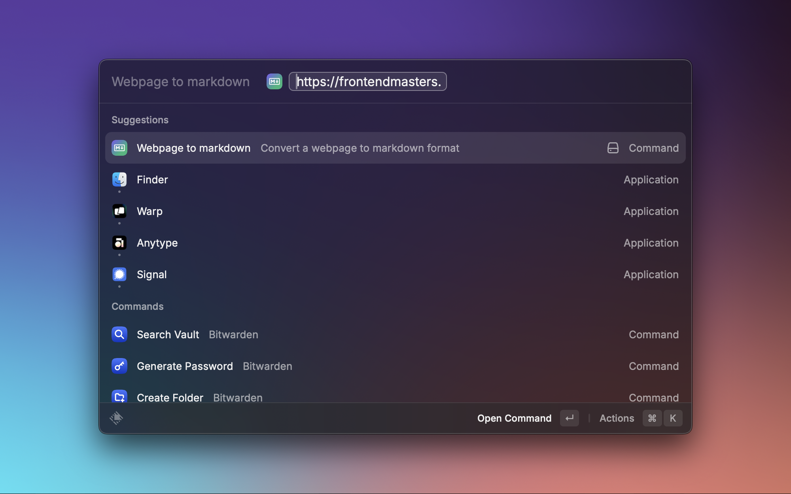
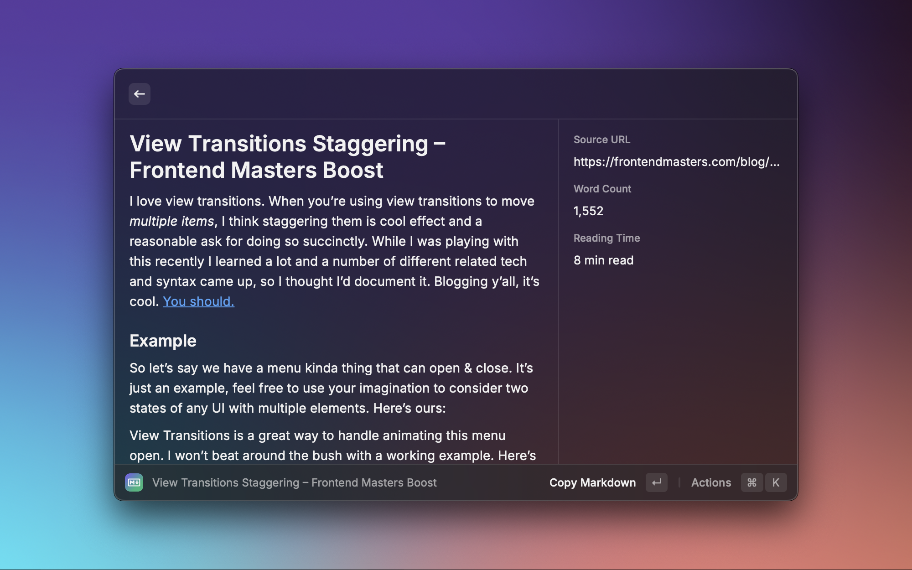

# Webpage to Markdown

  
  
  

  
Transform any webpage into clean markdown. View directly in Raycast or copy to clipboard. Perfect for developers, note-takers and content-creators who need to save web content in markdown format.

## Features

- Clean, instant conversion of web content to markdown
- Smart metadata tracking (word count, reading time)
- Automatic link collection and organization
- YAML front matter support for better organization
- Powered by Jina.ai's Reader API for reliable conversion
- Convert active browser tab to markdown directly (requires Raycast Browser Extension)
- Use clipboard content as fallback if it contains a valid URL
- Auto-copy conversion results to clipboard
- Silent mode for quick headless operation with helpful notifications
- Maintain headers, lists, code blocks, links and more
- Add front matter to your document
- Include a link summary section
- Include metadata in the Details view

## Commands

### Webpage to Markdown

Convert any webpage to Markdown by providing its URL.

### Browser Tab to Markdown

Convert the current active browser tab to Markdown automatically. Requires the Raycast Browser Extension.

## Actions

- Copy markdown output (`↵`)
- Open original webpage (`⌘` + `↵`)

## Preferences

### Global Preferences

- Include metadata sidebar (word count, reading time, source URL)
- Add YAML front matter with metadata
- Include organized links summary at the end
- Add Jina.ai API key for higher rate limits

### Browser Tab to Markdown Command Preferences

- Use clipboard as fallback when no active browser tab is found
- Auto-copy conversion results to clipboard
- Silent mode for headless operation (shows notifications for success/errors)

## Requirements

- Raycast Browser Extension (for Browser Tab to Markdown command)

## Installing the Browser Extension

The "Browser Tab to Markdown" command requires the Raycast Browser Extension to detect the active browser tab:

1. Open Raycast and type "Browser Extension"
2. Select "Browser Extensions" from the results
3. Follow the instructions to install the extension for your preferred browser

Once installed, the Browser Tab to Markdown command will be able to automatically retrieve the URL from your active browser tab.

## Examples

<table>
  <tr>
    <th>Input</th>
    <th>Output</th>
  </tr>
  <tr>
    <td></td>
    <td></td>
  </tr>
</table>
